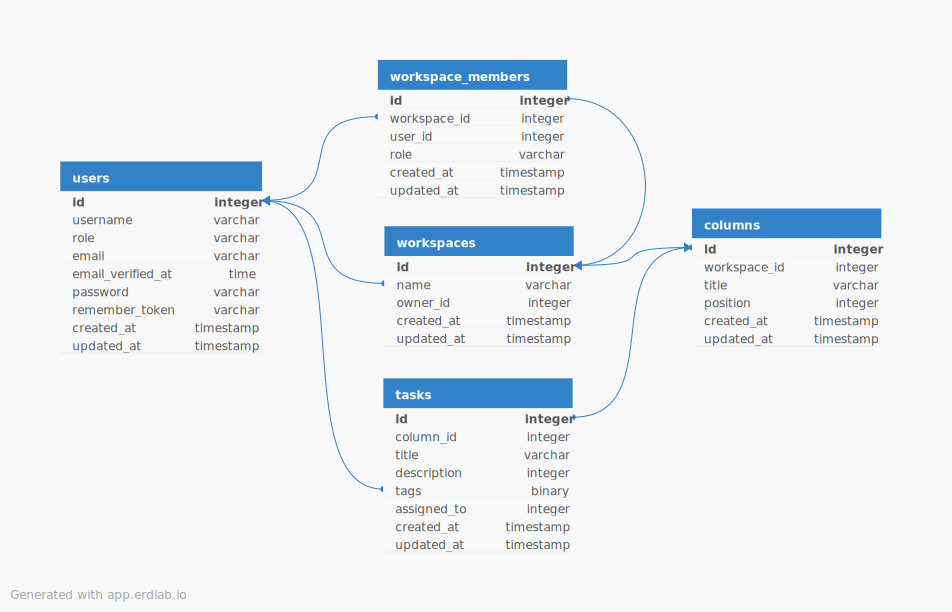

# Pulse

Платформа для отслеживания задач в виде канбан доски с разделением на workspaces. Работающий сайт -> https://pulse.vyache.space

# Архитектура

                 ┌──────────────────────────────┐
                 │          Laravel             │
                 │------------------------------│
                 │  - Workspaces                │
                 │  - Columns                   │
                 │  - Tasks CRUD                │
                 │  - Auth / Policies           │
                 └─────────────┬────────────────┘
                               │
                               │ Redis publish
                               ▼
                 ┌──────────────────────────────┐
                 │            Redis             │
                 │------------------------------│
                 │  Pub/Sub channel:            │
                 │  - new_task                  │
                 │  - task_update               │
                 └─────────────┬────────────────┘
                               │
                               │ subscribe
                               ▼
          ┌────────────────────────────────────────┐
          │              FastAPI WS Server         │
          │----------------------------------------│
          │  - Redis subscriber loop               │
          │  - WebSocket manager                   │
          │  - broadcast to clients                │
          └─────────────┬──────────────────────────┘
                        │
                        │ WebSocket (ws://.../ws)
                        ▼
        ┌──────────────────────────────────────┐
        │            React Frontend            │
        │--------------------------------------│
        │  Kanban UI                           │
        │  useEffect(WebSocket)                │
        │  - add task live                     │
        │  - update task live                  │
        └──────────────────────────────────────┘

# Запуск
Для запуска

1. Склонируйте репозиторий
   ```
   git clone https://github.com/vyache31/pulse.git pulse
   cd pulse
   ```
2. Настройте .env для Laravel
```
cd laravel
cp .env.example .env
cd ..
```
3. Создайте в корне проекта .env с содержимым
```
MYSQL_ROOT_PASSWORD=pulse
DB_USER=pulse
DB_PASSWORD=pulse
```
4. Установите зависимости и соберите Vite
```
cd laravel
npm install
npm run build
cd ..
```
5. Соберите и запустите контейнеры
```
docker compose build
docker compose up -d
```
6. Настройте локальные домены
	1. Windows
		1. Откройте блокнот от имени администратора
		2. Откройте в блокноте файл 
			`C:\Windows\System32\drivers\etc\hosts`
		Добавьте строки
		```
		127.0.0.1   pulse.vyache.localhost api.pulse.vyache.localhost
		```
7. Откройте основное приложение 
		http://pulse.vyache.localhost

# Основные сценарии

Вы можете:
1. Зарегистрироваться или войти через GitHub
2. Создать свой личный workspace и добавить в него других пользователей
3. Взаимодействовать с колонками и задачами в реальном времени
4. Добавлять в задачу теги и исполнителя из участников workspace
   
# Структура БД

